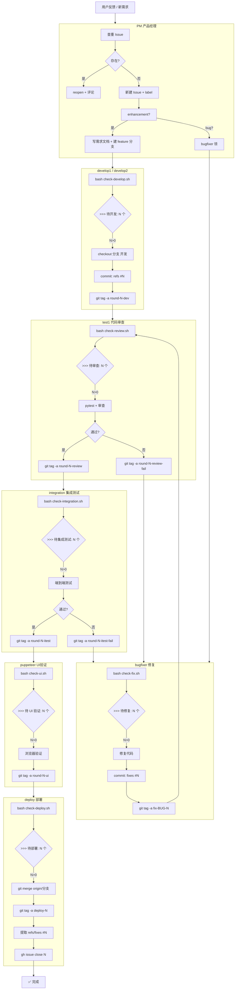

# Agent 协作流程图



## 角色对应

| 角色 | 命令 | 脚本 | Tag |
|------|------|------|-----|
| PM | /start → 1 | — | req-{name} |
| develop1/2 | /develop | check-develop.sh | round-N-dev |
| test1 | /review /test | check-review.sh | round-N-review / -fail |
| bugfixer | /fix | check-fix.sh | fix-BUG-N |
| integration | /integrationtest | check-integration.sh | round-N-itest / -fail |
| puppeteer | /puppeteer | check-ui.sh | round-N-ui |
| deploy | /deploy | check-deploy.sh | deploy-N |

## 异常路径

```
review-fail  → check-fix.sh 自动检测 → bugfixer 修复 → 重新打 dev tag → 重新走管线
itest-fail   → check-fix.sh 自动检测 → bugfixer 修复 → 重新走管线
僵尸任务     → 服务重启时自动重置 running=false
```
