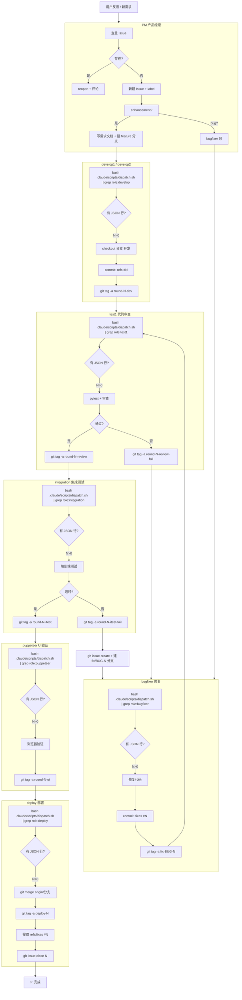

# Agent 协作流程图



## 角色对应

| 角色 | 命令 | 任务发现 | Tag |
|------|------|------|-----|
| PM | /start → 1 | — | req-{name} |
| develop1/2 | /develop | dispatch.sh \| grep develop | round-N-dev |
| test1 | /review /test | dispatch.sh \| grep test1 | round-N-review / -fail |
| bugfixer | /fix | dispatch.sh \| grep bugfixer | fix-BUG-N |
| integration | /integrationtest | dispatch.sh \| grep integration | round-N-itest / -fail |
| puppeteer | /puppeteer | dispatch.sh \| grep puppeteer | round-N-ui |
| deploy | /deploy | dispatch.sh \| grep deploy | deploy-N |

> 兜底：各角色也可用独立 `bash .claude/scripts/check-*.sh` 脚本输出人类可读格式；主入口始终是 `dispatch.sh` JSON。

## 异常路径

```
review-fail  → dispatch.sh 自动检测 → bugfixer 修复 → 重新走管线
itest-fail   → 集成测试先建 Issue → gh issue create → 建 fix/BUG-{N} 分支
              → bugfixer 修复打 fix-BUG-N tag → test1 审查 → integration 回测
僵尸任务     → 服务重启时自动重置 running=false
```

## 分支命名规范

| 类型 | 格式 | 示例 |
|------|------|------|
| 需求 | requirement/{功能名} | requirement/db-encrypt |
| 功能 | feature/{N}-{task} | feature/154-t1-db-password-encrypt |
| 修复 | fix/BUG-{N} | fix/BUG-155 |

> ⚠️ 修复分支统一用 `fix/BUG-{N}`（Issue 编号），不使用 `fix/{轮次}-itest-fail`。
